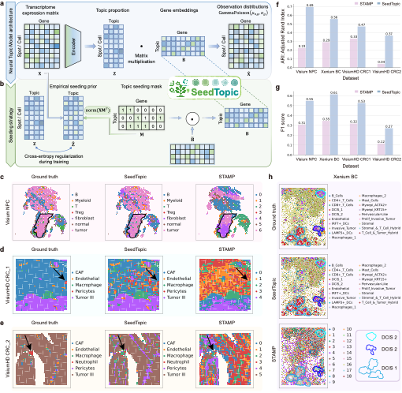

# SeedTopic
SeedTopic: Knowledge-informed topic modelling of spatial transcriptomics for efficient cell typing

Unlike fully unsupervised topic models which derive cell profiles solely from expression patterns, which may yield results that are hard to align and interprete, SeedTopic allows guided topic modeling with prior knowledge encoded in topic seeds (marker genes). As a result, the topics are interpretable by design.

Users can seed all topics for deriving a comprehensive cell type profile for a ST dataset [demo_all_topic](demo/demo.ipynb), or focus only on annotating one cell type with curated topic seeds [demo_single_topic](demo/demo_seed_single_topic.ipynb).



## Create environment
Using micromamba (change micromamba to conda if you are using conda package management)
```bash
micromamba create -n seededntm python=3.11 -y
micromamba install gxx_linux-64 gcc_linux-64 -c conda-forge -y
micromamba install pyproj -c conda-forge -y
micromamba install -c conda-forge cmake -y
micromamba install -c conda-forge hdf5 -y
micromamba install -c conda-forge pyarrow -y
micromamba install matplotlib-inline -c conda-forge -y
micromamba install ipython -c conda-forge -y
```

Install package
```bash
git clone https://github.com/qiaochen/SeedTopic.git
cd SeededNTM
pip install .
```


### Run topic modelling in commandline
Basic commandline usage: (please run `infer_seededntm --help` to view all the possible parameters)
```shell
infer_seededntm --condition_feat_path $TOPIC_SEEDS_PATH \
                --batch_size $BATCH_SIZE \
                --adata_h5ad_path $ADATA_PATH --key_input $KEY_INPUT  \
                --key_count_out $KEY_OUT  \
                --num_topics $NUM_TOPICS  \
                --exp_outdir $OUT_DIR 
                --key_topic_prior $KEY_TOPIC_PRIOR  \
                --reg_topic_prior $REG_TOPIC_PRIOR \
```
where 
- `--condition_feat_path`: specify the topic seed path (see [topic_seeds.txt](demo/topic_seeds.txt) as an example, and the demo notebooks for details)
- `--batch_size`: training batch size, the number of cells in each batch
- `--adata_h5ad_path`: the adata path for modelling
- `--key_input`: key to the input expression stored in adata.obsm
- `--key_count_out`: key to the output count expression data stored in adta.obsm, use `--key_normal_out` if observation counts are normalized.
- `--num_topics`: number of topics to fit, should be consistent with the topic_seeds list file
- `--exp_outdir`: directory where the output topic annotations are to be stored
- `--key_topic_prior`: key to topic priors stored in adata.obsm, refer to [demo](demo/demo.ipynb) for how topic priors are generated
- `--reg_topic_prior`: regularization strength of topic prior, refer to [demo](demo/demo.ipynb) for comments on its value.

### Example demo notebooks
The demo notebooks show input preperation and model training examples:

- For a demo with complete topic seeding, refer to [demo_all_topic](demo/demo.ipynb) 
- For a demo with single topic seeding and annotation, refer to [demo_single_topic](demo/demo_seed_single_topic.ipynb) 


